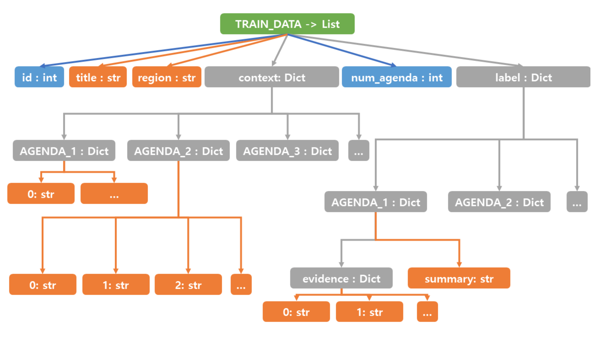

# AI_SUM_GEN

- Participants
    - [khs070911](https://github.com/khs070911), [kwangjunechoi7](https://github.com/kwangjunechoi7)
- Schedule
    - 211001 ~ 211025

## workflow
- step one
    - 211003 
        - first meeting
        - scheduling with teammate 
- step two
    - transfer learning for summarization 
    - 211004 ~ 211010
    - raw data EDA
    - paper survey
        - LM model
        - methodology
    - LM model finetuning experiment
        - i.g. BERTSumExt
        - i.g. BERTSumAbs
- step three
    - generation
    - 211011 ~ 211023
    - NLG survey
    - NLG test
- step four 
    - 211024 ~ 211025
    - result summit

- [ROUGE score](https://huffon.github.io/2019/12/07/rouge/)
