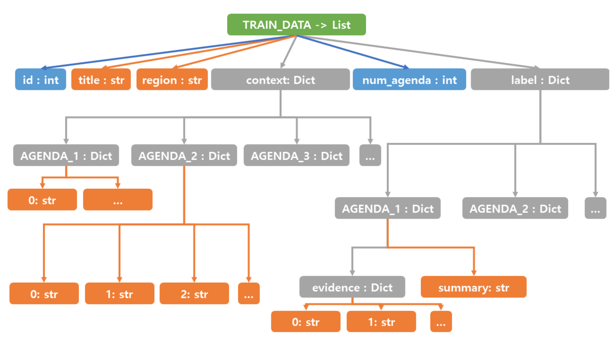

# 진행상황

## WEEK 1

- BERTSum 논문 살펴보기
    - BERTSumExt check
    - BERTSumAbs x
- BERTSum 학습 환경 구축
    - 회사 210번 서버 
        - BERTExt 테스트 진행 완료
            - "distilbert-base-uncased" 기준
            - finetuning running time -> 35 ~ 40 sec
    - 회사 200번 서버 
        - GPU 연결 외 완료
        - 테스트 진행 예정
- fine tuning util 분석

### To do 
- 개발 환경 구축 및 테스트 
    - 200번 서버 테스트
    - 200번 서버 테스트 완료 시 한글 테스트
    - 이후 구축한 util을 기반으로 colab에 개발환경 생성 

- 생성 요약 부분 이해 
    - extractive -> generation 
    - 추출 요약을 어떻게 학습할 것인가?
    - 단어 구 단위로 학습 필요 -> check 할 것 
    - 생성을 위한 추출 학습

- raw 데이터 살펴보기
    - 학습

- ROUGE score util 
    - 평가 지표 기능 이해 및 생성 

## WEEK 2

#### doing
- baseline 코드 분석
- konlpy & mecab 설치
- tweepy 오류 수정
- baseline local test